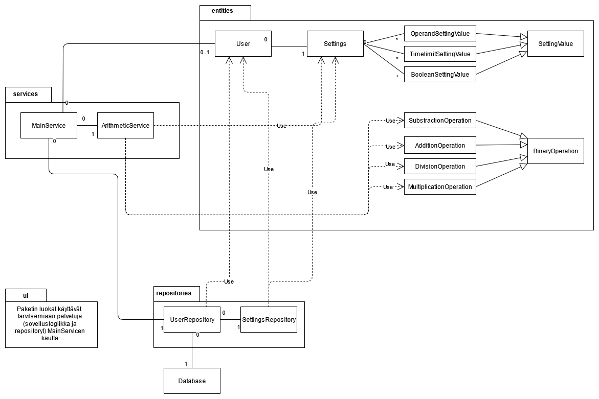
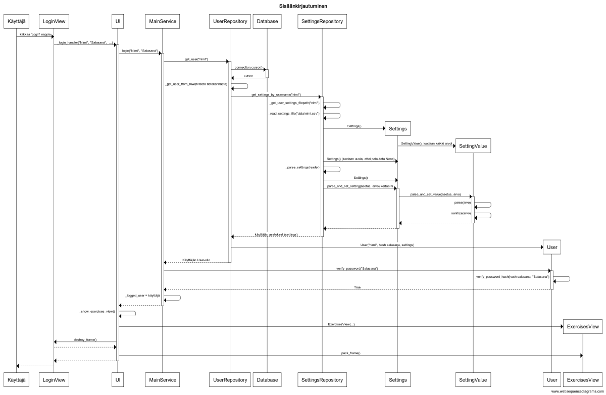

# Arkkitehtuuri

## Sovelluksen yleisrakenne

Sovellus perustuu pitkälti referenssisovelluksen tapaiseen rakenteeseen, jossa kaikki käyttöliittymään liittyvä on sijoitettu ui-paketin alle. Ui-paketin alaisuudessa on myös alipaketti components, joka sisältää eri käyttöliittymänäkymien teossa käytettäviä komponentteja, kuten eri asetusten yksilölliset asetusframet. 

Services-pakkauksen alaisuudessa ovat sovelluksen MainService ja laskujen luontiin ja tarkastukseen tarkoitettu ArithmeticService. Käyttöliittymän eri luokat käsittelevät sovelluslogiikan asioita yleisesti vain MainServicen kautta.

Repositories-pakkaus sisältää massamuistiin tallennukseen käytettävät SettingsRepository ja UserRepository luokat. Näiden ansioista ohjelmalla on "pysyvä" käsitys käyttäjistä ja heidän henkilökohtaisista asetuksista.

Entities-pakkauksen luokilla on tarkoitus mallintaa ohjelman toisiinsa liittyviä käsitekokonaisuuksia, kuten käyttäjä (User) tai käyttäjän asetukset (Settings).

### Pakkauskaavio


### Sekvenssikaavio
Alla sekvenssikaavio käyttäjän onnistuneesta sisäänkirjautumisesta.


## Käyttöliittymän kuvaus

Käyttöliittymä noudattaa referenssisovelluksen tapaista käytäntöä käyttöliittymän kanssa. Jokainen käyttöliittymän näkymä on toteutettu erillisinä luokkinaan, joiden vaihdosta lopulta huolehtii UI-luokka. Yritin toteuttaa UI-luokat niin, että ne käsittelevät sovelluslogiikkaa vain MainService-luokan kautta.

Harjoitusnäkymissä (luokat AdditionView, SubstractionView, DivisionView, MultiplicationView ja RandomView määritelty [exercises.py](../src/ui/exercises.py)) käyttäjälle luodaan MainServicen kautta saadulla ArithmeticServicellä käyttäjän asetuksien mukaisia tehtäviä käyttäen sen metodeja, esim. [get_addition_question](https://github.com/rtammisalo/ot-harjoitustyo/blob/master/src/services/arithmetic_service.py#L59).

[SettingsViewissä](../src/ui/settings.py) käyttäjä voi muuttaa asetuksiaan ja tallettaa ne seuraavalle kerralle. Asetuksia kirjoittaessa ohjelma kertoo, onko kyseinen asetus virheellinen. Luokka käyttää komponentteinaan [ui/components/settings_frames.py](../src/ui/components/settings_frames.py):stä löytyviä frameja esittämään eri asetukset ryhmittäin.

## Sovelluslogiikan kuvaus

Sovelluslogiikassa keskeisinä elementteinä ovat seuraavat käsitteet entities-paketin luokkina:

- User: käyttäjään liittyvä tieto. Nimi, salasana, asetukset. Salasanat ovat kaikki hashattu ja suolattu käyttäen Passlib nimistä ulkoista kirjastoa. Käyttäjän salasanoja voidaan verrata hashattuun User-olion salasanaan käyttämällä [verify_password()](https://github.com/rtammisalo/ot-harjoitustyo/blob/master/src/entities/user.py#L38)-metodia. Hashin verifioinnin toiminallisuus saadaan injektiolla UserRepository-luokalta, joten ei tarvitse kirjoittaa erillistä riippuvuutta UserRepositoryn käyttämään salasanan hasheriin. Ohjelmassa käytetty sisäänkirjautuneen käyttäjän User-olio luodaan UserRepositoryssä.
- Settings: käyttäjän henkilökohtaiset ohjelman käyttöasetukset, kuten mikä on yhteenlaskutehtävien aikaraja tai minkä lukujen väliltä kertolaskun eri operandit valitaan. Erilliset asetukset säilytetään dict-oliossa ja niitä varten on toteutettu erilliset [SettingValue](https://github.com/rtammisalo/ot-harjoitustyo/blob/master/src/entities/setting_value.py)-luokan perivät luokat, joiden avulla voidaan muuntaa käyttäjältä saadut arvot oikean tyyppisiksi ja varmistaa, ettei ne ole ulkona halutusta joukosta.
- Operaatiot: Näistä binääri-operaatio luokista luodaan kysymykset mihin käyttäjä voi kirjoittaa vastauksensa.


Koko sovelluksen sitoo yhteen services-paketin MainService, jonka avulla voidaan kirjata käyttäjä sisään, luoda uusia käyttäjiä, ja saadaan myös viittaus toimivaan ArithmeticServiceen, joka on alipalvelu käyttäjälle esitettävien kysymyksien luomista ja vastauksen tarkistamista vasrten. Käyttöliittymän luokat saavat tarvitsemansa sovelluslogiikan palvelut MainServicen kautta riippuvuuden injektoinnilla. MainService käyttää UserRepositorya ja sen kautta SettingsRepositorya talletettavan tiedon käsittelyyn.

## Tiedon talletus

Sovelluksen tallennustiedon käsittely tehdään referenssisovelluksestakin tutuilla Repository-patternilla. Repositories-pakkauksen UserRepository tarjoaa mahdollisuuden tallentaa käyttäjän tiedot (nimi, salasana ja id) SQLite-tietokantaan. Salasanat talletetaan tietokantaan käyttäen Passlibin hashausta eli ne eivät talletu selkokielisinä. Koska jokaiseen käyttäjään liittyy sovelluksessa olennaisesti hänen oma henkilökohtainen asetustiedosto, on UserRepositoryllä myös viittaus SettingsRepositoryyn. SettingsRepositoryn tehtävänä on lukea hakemistosta käyttäjän oma .csv-tyyppinen asetustiedosto ja myös tarvittaessa tallettaa uudet asetukset tiedostoon.

Riippuvuuksien injektoinnin ansioista voidaan testauksessa käyttää stub-repositoryjä, kun halutaan vain yksikkötestata vain yhden luokan toiminnallisuutta.

### Asetustiedostojen talletusmuoto

SettingsRepositoryn lataamilla asetuksilla on .csv tiedostoissa muoto:

```
...
divide_operand2_min,2
divide_operand1_max,9
divide_operand2_max,9
divide_timelimit,10000
...
```

## Ohjelman käyttämien tiedostojen muuttaminen

Kaikki luokat voivat käyttää src-hakemiston juuresta löytyvää Config-luokkaa, jonka luokkamuuttujat antavat polut projektin juuressa olevasta .env tiedostosta löytyviin käyttäjän asettamiin default asetustiedostoon, käyttäjien asetustiedostojen hakemistoon sekä tietokantaan.
