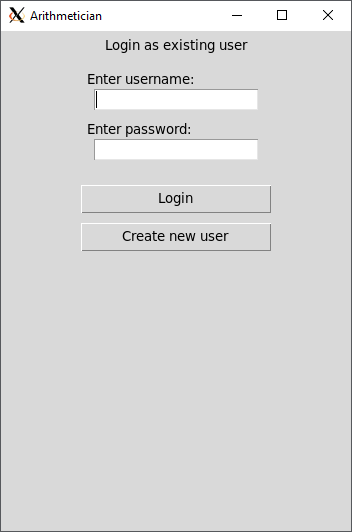
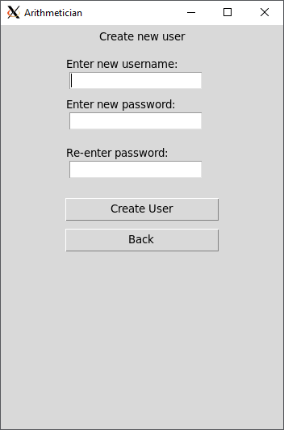
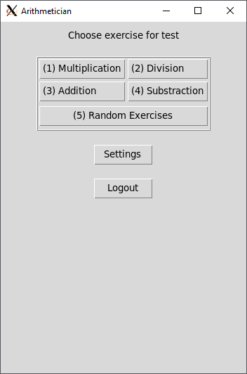
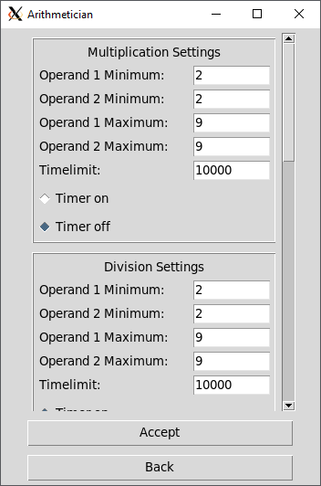
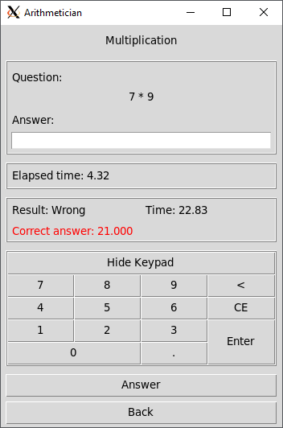

# Käyttöohje

## Ohjelman asetukset

Ohjelma tukee projektin juuressa olevaa .env tiedostoa. Käyttäjä voi halutessaan vaihtaa tietokannan, oletus asetustiedoston nimeä ja käyttäjien tallennushakemistoa.

```
DB_FILENAME=db.sqlite
USER_CSV_PATH=users
USER_DEFAULT_CSV_FILENAME=default_user.csv
```

## Ohjelman käynnistäminen

Ohjelma käynnistetään projektin juuresta komennolla:
``` bash
poetry run invoke start
```

Jos käyttäjä haluaa, niin hän voi tyhjentää käyttäjien tietokannan komennolla:
``` bash
poetry run invoke build
```

Jos käyttäjällä ei ole toimivaa Poetry-asennusta, tulee sellainen tehdä noudattaen kurssin [Poetryn asennusohjeita](https://ohjelmistotekniikka-hy.github.io/python/poetry).

## Sisäänkirjautuminen

Ohjelma tukee vain käsitteelisesti käyttäjä-tilejä. Käyttäjän tulee ennen käyttöä kirjautua sisään tai luoda uusi tunnus.

Sisäänkirjautuminen tapahtuu kirjoittamalla aloitusruudussa olemassa olevan käyttäjän nimi ja kyseiseen tiliin liittyvä salasana.



Klikkaamalla "Create new user"-nappia voidaan luoda uusia käyttäjätilejä.



## Harjoituksien valitseminen

Sisäänkirjauduttuaan käyttäjä voi valita eri harjoitusmuotoja tai muuttaa niiden asetuksia Settings-näkymästä.



## Asetukset

Asetusnäkymässä on listassa kaikki harjoituksien eri asetukset kategorioittain. Asetuksia voi vaihtaa kirjoittamalla uuden
arvon kenttään ja painamalla 'Accept'-nappia, jonka jälkeen ohjelma tallentaa uudet hyväksytyt asetukset tiedostoon. 



## Harjoittelu

Harjoittelunäkymässä on näkyy uusi halutun tyyppinen kysymys, käytetty aika ja (jos päällä) jäljellä oleva aika. Vastaukset tehdään kirjoittamalla kenttään
näppäimistöllä ja painamalla enteriä tai käyttämällä näkymässä olevaa graafista numeronäppäimistöä. Käyttäjä voi myös käyttää ruudulla olevaa 'Answer'-nappia. Kun käyttäjä on vastannut, valitsee ohjelma uuden kysymyksen ja näyttää sen ruudulla. Käyttäjälle näytetään myös oliko edellinen vastaus oikein ja vastaukseen kuluneen ajan. Näkymästä pääsee takaisin painamalla 'Back'-nappia.


