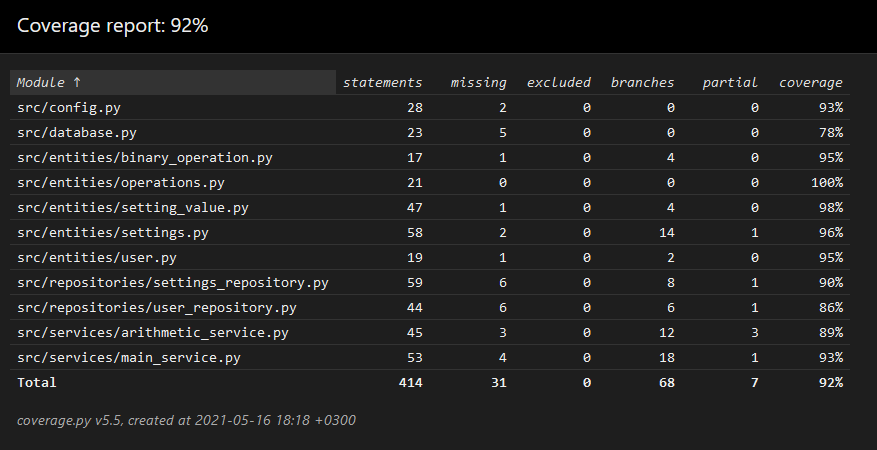

# Testidokumentti

## Haarakattavuus

Haarakattavuusraporttiin ei otettu mukaan komentoriviltä ajettavia `src/build.py`- ja `src/main.py`-, `__init__.py`-tiedostoja, eikä testejä tai käyttöliittymäluokkia.

## Automaattitestaus

### Service-paketti
Service-tason luokkaa MainService yksikkötestattiin käyttämällä injektoinnilla annettavaa fake_user_repository:ä. Luokalla on myös yleisempi aitoa testitietokantaa
käyttävä integraatiotesti asetustiedostojen latauksesta, joka yrittää ladata aikaisemmin muutetun käyttäjän asetustiedoston. ArithmeticServicen metodeja testataan
yksikkötestauksella.

### Entities-paketti
Paketin kaikkia luokkia pyritään testaamaan yksikkötesteillä, mutta niitä integraatiotestataan myös muiden pakettien testeissä.

### Repositories-paketti
SettingsRepositoryä testataan erillaisilla testitiedostojen lukemisella. UserRepository-testeissä käytetään testauksessa testitietokantaa ja injektoimalla 
fake_settings_repository aidon SettingsRepositoryn tilalle. Molempien luokkien testaus siis perustuu suurimmin osin integraatiotesteihin.

### Ui-paketti
Käyttöliittymän luokkia ja toiminnallisuutta testattiin vain käsin testialustoilla.

## Manuaalitestaus
Lopullista ohjelmaa on testattu käsin kolmella eri alustalla: WSL:n alla Ubuntu 20.04:ssa, fuksiläppärin Cubblissa ja koulun virtuaalidesktopin Cubbli Linuxissa.
Testaamisessa on pyritty käymään kaikki vaatimusmäärittelydokumentissa mainitut ominaisuudet ja myös yritetty syöttää huonoa tai tyhjää tietoa eri lomakkeille.

Kokeilen myös `.env`-tiedostojen arvojen muuttamista.

## Ratkaisemattomat ongelmat
- Virtualdesktopin kautta ohjelma joskus jumahtaa näkymää vaihdettaessa vähäksi aikaa. En kyennyt toistamaan tätä ongelmaa kummallakaan toisista alustoista.
- Asetuksia annettaessa ei ohjelma valita, jos jonkin laskuoperandin minimi on maksimia suurempi. Tämä ei kuitenkaan kaada ohjelmaa ja se lasketaan vain tilanteeksi, missä minimi on maksimi.
- Jos käyttäjä ei valitse yhtään satunnaisharjoitusmuotoa, niin tällöin annetaan kaikkia harjoituksia satunnaisesti satunnaisharjoittelunäkymässä.
